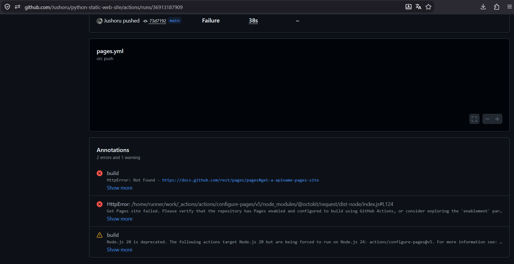
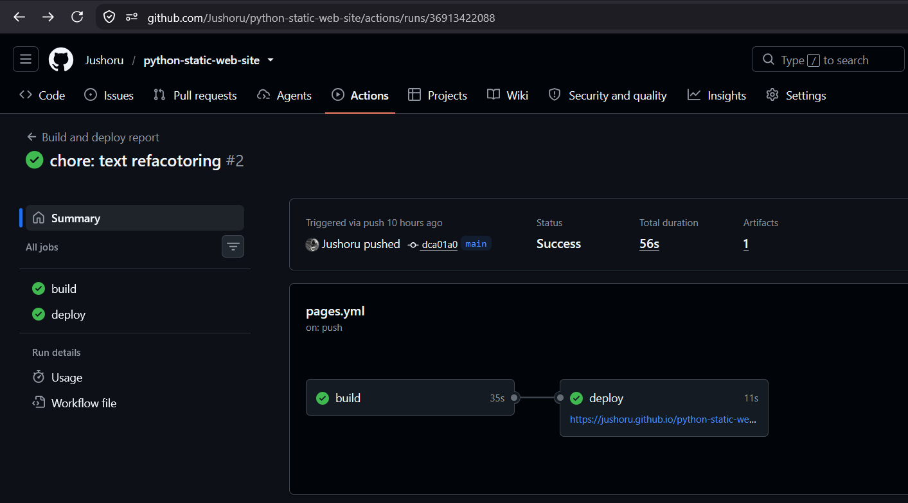
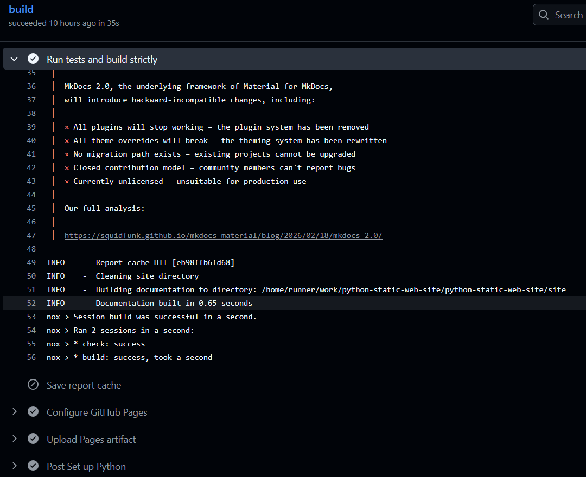
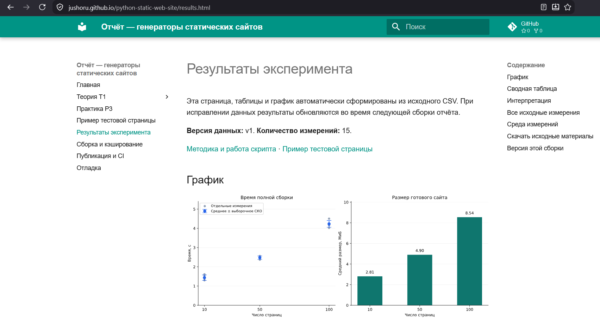
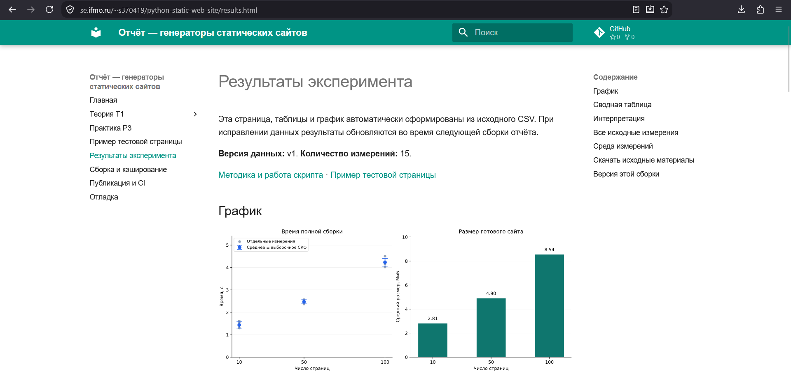

# Публикация и непрерывная интеграция

## Результат публикации

Отчёт опубликован на [GitHub Pages](https://jushoru.github.io/python-static-web-site/)
и [Helios](https://se.ifmo.ru/~s370419/python-static-web-site/).
Исходники и workflow доступны в [репозитории проекта](https://github.com/Jushoru/python-static-web-site).

Сборка и публикация автоматизированы в `.github/workflows/pages.yml`.
Первый запуск завершился ошибкой получения настроек Pages, а следующий push
успешно выполнил сборку и `deploy`. После первоначального ручного размещения
на Helios настроена автоматическая передача файлов по SFTP; ошибка хранения
ключей устранена переносом значений в Secrets.
[Скриншоты запусков и опубликованных сайтов](#evidence) приведены ниже,
причины ошибок разобраны в [разделе отладки](debugging.md).

## Что автоматизируется

После push в `main` GitHub выделяет временный сервер Ubuntu, загружает исходники,
устанавливает Python 3.14 и точные зависимости. Затем выполняются проверки,
подготовка результатов с кэшем и строгая сборка MkDocs. Успешно собранная папка
`site` публикуется на GitHub Pages, `site-helios` передаётся по SFTP на Helios.

Эксперимент `benchmark.py` и замер ускорения кэша автоматически не запускаются.
Их результаты уже лежат в `data`. Изменение экспериментального CSV приводит
к пересчёту статистики и графиков при следующей сборке.

```text
push в main → GitHub Actions → зависимости → восстановление кэша
                                           ↓
                                  проверки → nox build
                                           ↓
                               ├─ site → GitHub Pages → HTTP-проверки
                               └─ helios-site → SFTP → Helios → HTTP-проверки
```

Событие `pull_request` выполняет проверки и сборку без публикации. Событие
`workflow_dispatch` позволяет запустить workflow вручную. Публикация разрешена
только для `main` и только после успешного задания `build`.

## Два способа публикации Pages

| Свойство | Ветка `gh-pages` | Официальный артефакт Pages |
| --- | --- | --- |
| Что делает workflow | Например, `peaceiris/actions-gh-pages` записывает готовый HTML отдельным коммитом в ветку | `upload-pages-artifact` сохраняет готовую папку, `deploy-pages` публикует её |
| Настройка Pages | Deploy from a branch → `gh-pages` → `/ (root)` | GitHub Actions |
| Где находится результат | В истории Git отдельной ветки | В артефакте запуска Actions и опубликованном сайте |
| Основные права публикации | `contents: write` для записи в ветку | `pages: write` и `id-token: write` у задания публикации |
| Применение здесь | Рассмотрен для сравнения | Выбран для проекта |

Оба варианта могут автоматически работать после push. Выбран официальный
артефактный подход: для публикации не требуется создавать коммиты с HTML.
Исходники остаются в `main`, а сгенерированная папка `site` не добавляется в Git.

Источники: [пользовательские workflows Pages](https://docs.github.com/en/pages/getting-started-with-github-pages/using-custom-workflows-with-github-pages),
[peaceiris/actions-gh-pages](https://github.com/peaceiris/actions-gh-pages).

## Пояснения к workflow

### Полный текст пайплайна

Ниже при каждой сборке включается актуальное содержимое
`.github/workflows/pages.yml` вместе с комментариями. Отдельная копия YAML
в Markdown не поддерживается, поэтому описание не расходится с исходным файлом.

<!-- WORKFLOW_SOURCE -->

### Назначение шагов

| Блок или шаг | Назначение |
| --- | --- |
| `on` | Сборка после push и при pull request в `main`, возможность ручного запуска |
| `permissions` | Чтение исходников у сборки; дополнительные права Pages только там, где они нужны |
| `concurrency` | Разделяет запуски по веткам/PR; уже начатая публикация не прерывается новым push |
| `Checkout source` | Загружает исходники конкретного коммита |
| `Set up Python` | Выбирает Python 3.14, включает отдельный кэш скачанных пакетов pip |
| `Install pinned dependencies` | Устанавливает версии из `requirements.txt` и выполняет `pip check` |
| `Calculate report cache key` | Вызывает ту же функцию `cache_key()`, что использует подготовка отчёта |
| `Restore report cache` | Восстанавливает каталог результатов для точного ключа; приблизительный подбор старых ключей отключён |
| `Run tests and build strictly` | Выполняет `nox --no-venv -s check build`: тесты и `mkdocs build --strict` |
| `Build Helios site` | Собирает те же документы с конфигурацией Helios в отдельную папку `site-helios` |
| `Upload Helios artifact` | Сохраняет `helios-site` для скачивания и первоначальной загрузки по SFTP; сам ничего на Helios не отправляет |
| `Save report cache` | Сохраняет новый кэш после успешной сборки основной ветки |
| `Configure GitHub Pages` | Читает настройки Pages репозитория |
| `Upload Pages artifact` | Передаёт только содержимое `site` для публикации |
| `deploy`, `needs: build` | Запускает `deploy-pages` только после успешного `build`; записывает URL в окружение `github-pages` |
| `Check published GitHub Pages` | Проверяет HTTP, контрольную строку, SHA коммита, индекс и графики после публикации |
| `deploy-helios` | Скачивает артефакт, загружает его через SFTP и проверяет опубликованную версию |

Nox в CI использует Python временного сервера через `--no-venv`, потому что
этот сервер уже изолирован от локального компьютера. Это также обеспечивает
совпадение окружения при вычислении ключа и при подготовке отчёта.
Минорная версия Python фиксирована как 3.14; обновление патч-версии может
изменить ключ кэша и вызвать нормальный пересчёт.

## Кэш между запусками Actions

Обычная папка на временном сервере исчезает после запуска. Поэтому workflow
отдельно сохраняет `.cache/report/<ключ>` через `actions/cache` и восстанавливает
её в следующем запуске. Переносятся только результаты для нужного ключа.

В Git папка `.cache` не добавляется. Кэш pip ускоряет скачивание зависимостей,
а кэш отчёта позволяет пропускать вычисления и построение графиков — это разные
механизмы. Обработчик дополнительно проверяет целостность восстановленных
файлов, прежде чем вывести `Report cache HIT`.

| Ситуация | Ожидаемое поведение |
| --- | --- |
| Первая сборка на GitHub | Обычно `MISS`: локальный Windows-кэш туда не переносился |
| Повторный запуск того же коммита | `HIT`, если предыдущий кэш сохранён и доступен |
| Правка только обычного текста отчёта или цветов | `HIT` при прежних данных и окружении; HTML сайта обновляется |
| Изменение CSV, кода обработки или зависимостей | Новый ключ, обычно `MISS`, после успешного расчёта сохраняется новый кэш |
| Кэш удалён или вытеснен GitHub | `MISS`; сайт всё равно можно собрать из исходных данных |

Ключ включает ОС и версии библиотек. Поэтому опубликованная на Linux страница
может предупреждать, что сохранённые замеры ускорения получены в другой среде
(Windows). Это корректное ограничение: оно не означает поломку кэша и не требует
выдавать локальные замеры за измерения GitHub Actions.

Источник: [кэширование в Actions](https://docs.github.com/en/actions/reference/workflows-and-actions/dependency-caching).

## Конфигурация GitHub Pages

В настройках репозитория выбран источник публикации **GitHub Actions**.
Задание `deploy` использует временный `GITHUB_TOKEN` и механизм OIDC;
готовый HTML передаётся через артефакт Pages.

## Базовый URL и подкаталоги

В `mkdocs.yml` уже указано:

```yaml
site_url: "https://jushoru.github.io/python-static-web-site/"
use_directory_urls: false
```

Ссылки между документами записываются относительно страницы, например
`theory.md`, а изображения — `assets/theory/radar_ssg.png`.
Ссылка `/assets/...` обращалась бы к корню домена и могла бы ломаться при
размещении сайта в подкаталоге.

Для Helios используется `mkdocs.helios.yml`:

```yaml
INHERIT: mkdocs.yml
site_url: "https://se.ifmo.ru/~s370419/python-static-web-site/"
site_dir: site-helios
```

`INHERIT` берёт содержимое, тему, плагины и хуки из основного файла. Меняются
адрес сайта и каталог результата. Поэтому основной `site` остаётся сборкой
для GitHub Pages, а `site-helios` предназначен для Helios. Обе папки исключены
из Git. Обработка данных общая: вторая сборка может повторно использовать кэш
первой, поскольку меняется адрес публикации, а не экспериментальные данные.

Источник: [наследование конфигурации MkDocs](https://www.mkdocs.org/user-guide/configuration/#configuration-inheritance).

## Автоматическая публикация на Helios {#helios}

Первое размещение выполнено вручную через SFTP. Последующие обновления
передаёт задание `deploy-helios`: оно скачивает артефакт `helios-site`
из того же запуска и вызывает `scripts/deploy_helios.py`.

Адрес и порт подключения передаются через Variables окружения `helios`,
SSH-ключ и проверенный ключ сервера — через Secrets. Задание включается
переменной репозитория `HELIOS_DEPLOY_ENABLED` со значением `true`.

На сервер передаются готовые HTML, стили, изображения, поисковый индекс
и скачиваемые материалы. Каталог размещения:
`/home/studs/s370419/public_html/python-static-web-site/`.
Установка Python и зависимостей на Helios не требуется.

Ресурсы загружаются перед HTML. Права каталогов — 755, файлов — 644.
Скрипт работает только с каталогом отчёта и не удаляет устаревшие файлы.
Загрузка не атомарна: при обрыве возможен частично обновлённый сайт,
который восстанавливается повторным успешным запуском.

Оба задания публикации зависят от успешного `build` и выполняются независимо:
ошибка передачи на Helios не отменяет публикацию GitHub Pages.

## Проверки после публикации

После публикации на каждой площадке workflow запускает
`scripts/check_published.py` с адресом сайта и полным SHA коммита.

| Проверка | Назначение |
| --- | --- |
| HTTP 200 у страниц и ресурсов | Проверка доступности опубликованных файлов |
| `PYTHON-STATIC-REPORT-T1-P3` на главной | Идентификация отчёта |
| SHA коммита на странице результатов | Проверка соответствия текущему запуску |
| Непустой JSON поискового индекса | Проверка доступности и структуры индекса |
| Две формулы MathML с номерами | Проверка включения формул в HTML практики |
| График SVG, радар PNG и схема JPG | Проверка форматов и доступности изображений |

При задержке обновления сайта скрипт повторяет запросы. Если проверки
не пройдены, задание завершается ошибкой. Переданные файлы автоматически
не откатываются. HTTP-проверка индекса не заменяет проверку поискового
интерфейса в браузере.

Формулы записаны в HTML средствами MathML, графики сохранены локально:
для их отображения не требуется загрузка библиотек с внешних CDN.

## Подтверждения публикации {#evidence}

Результаты публикации зафиксированы на скриншотах,
сохранённых в `docs/assets/screenshots`.

### Неуспешный запуск GitHub Actions {#failed-run}

{ loading=lazy }

На снимке [запуска 36913187909](https://github.com/Jushoru/python-static-web-site/actions/runs/36913187909)
видны статус `Failure`, коммит `73d7192` и сообщения `HttpError: Not Found`
и `Get Pages site failed`. Ошибка возникла при получении настроек GitHub Pages.
[Причина сбоя и результат исправления](debugging.md#pages-api).

### Успешный GitHub Actions

{ loading=lazy }

На снимке [запуска Actions](https://github.com/Jushoru/python-static-web-site/actions/runs/36913422088)
видны успешные `build` и `deploy` и коммит `dca01a0`.
Это подтверждение публикации GitHub Pages до добавления автоматической передачи
на Helios. Задание `deploy-helios` в этом запуске ещё отсутствовало.

| Этап запуска 36913422088 | Длительность, с | Что измерено |
| --- | ---: | --- |
| `build` | 35 | Всё задание сборки, включая установку зависимостей |
| `deploy` | 11 | Задание публикации GitHub Pages |
| Весь workflow | 56 | Полная длительность по интерфейсу Actions, включая переходы между заданиями |

Значения взяты из скриншота одного запуска и округлены интерфейсом до секунд.
Это не время компиляции MkDocs и не среднее по нескольким повторам.
Длительность автоматической загрузки на Helios в этом запуске не измерялась.

### Повторное использование результатов

{ loading=lazy }

В логе видны `Report cache HIT [eb98ffb6fd68]` и успешная сборка. Пропуск шага
`Save report cache` ожидаем: кэш с этим ключом уже был восстановлен.
Скриншот подтверждает попадание в кэш, но не заменяет отдельные замеры ускорения.

### Отчёт на GitHub Pages

{ loading=lazy }

На снимке видны адрес GitHub Pages, версия данных v1, 15 измерений и графики P3.

### Отчёт на Helios

{ loading=lazy }

На снимке видны адрес `se.ifmo.ru/~s370419/python-static-web-site/results.html`
и графики P3. Первое размещение выполнено вручную через SFTP;
проверены открытие страниц и отображение графиков.
