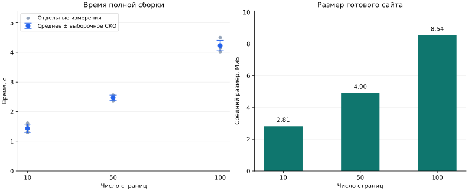

# Результаты эксперимента

Эта страница, таблицы и график автоматически сформированы из исходного CSV.
При исправлении данных результаты обновляются во время следующей сборки отчёта.

**Версия данных:** v1. **Количество измерений:** 15.

[Методика и работа скрипта](practice.md) · [Пример тестовой страницы](example.md)

## График

Серые точки — отдельные измерения. Синие точки — средние значения; вертикальные
отрезки показывают плюс-минус одно выборочное стандартное отклонение (СКО).
Это характеристика разброса повторов, а не доверительный интервал среднего.
Для единственного повтора СКО оценить нельзя; на графике отрезок не отображается.

График сохранён локально и не требует внешних CDN. [Скачать SVG](assets/generated/build-times.svg) · [Скачать PNG](assets/generated/build-times.png)

## Сводная таблица

| Страниц | Повторов | Среднее, с | Медиана, с | СКО, с | Минимум, с | Максимум, с | Средний размер, МиБ |
| ---: | ---: | ---: | ---: | ---: | ---: | ---: | ---: |
| 10 | 5 | 1,435 | 1,411 | 0,143 | 1,296 | 1,610 | 2,81 |
| 50 | 5 | 2,472 | 2,512 | 0,090 | 2,372 | 2,563 | 4,90 |
| 100 | 5 | 4,231 | 4,236 | 0,175 | 4,022 | 4,503 | 8,54 |

Размер включает все файлы тестового сайта: HTML, стили, JavaScript, поисковый индекс
и другие ресурсы. 1 МиБ = 1 048 576 байт. Это не размер одной страницы и не объём
сетевой передачи с HTTP-сжатием.

## Интерпретация

При увеличении объёма с 10 до 100 страниц среднее время изменилось с 1,435 до 4,231 с (отношение: 2,95).
Эти результаты относятся к указанному компьютеру и тестовым страницам. По небольшому
числу размеров и повторов нельзя установить универсальный закон роста времени
или сделать вывод, что MkDocs быстрее другого генератора.

## Все исходные измерения

| Страниц | Повтор | Время, с | Размер сайта, байт |
| ---: | ---: | ---: | ---: |
| 10 | 1 | 1,295992 | 2946200 |
| 10 | 2 | 1,411291 | 2946200 |
| 10 | 3 | 1,304775 | 2946200 |
| 10 | 4 | 1,553074 | 2946200 |
| 10 | 5 | 1,610315 | 2946200 |
| 50 | 1 | 2,512313 | 5136440 |
| 50 | 2 | 2,562955 | 5136440 |
| 50 | 3 | 2,371730 | 5136440 |
| 50 | 4 | 2,379147 | 5136440 |
| 50 | 5 | 2,534870 | 5136440 |
| 100 | 1 | 4,235780 | 8958848 |
| 100 | 2 | 4,158632 | 8958848 |
| 100 | 3 | 4,021917 | 8958848 |
| 100 | 4 | 4,503186 | 8958848 |
| 100 | 5 | 4,236551 | 8958848 |

## Среда измерений

| Параметр | Значение |
| --- | --- |
| Начало эксперимента, UTC | 2026-09-30T20:18:26.794972+00:00 |
| Операционная система | Windows 11 |
| Процессор (идентификатор системы) | AMD64 Family 23 Model 24 Stepping 1, AuthenticAMD |
| Логических процессоров | 8 |
| Python | 3.14.5 |
| MkDocs | 1.6.1 |
| Material | 9.7.7 |
| Прогревочных сборок на размер | 1 |
| Начальное значение перемешивания | 42 |

## Скачать исходные материалы

- [Измерения CSV](downloads/build_times.csv)
- [Параметры эксперимента JSON](downloads/build_times.metadata.json)
- [Пакеты среды измерений](downloads/benchmark_environment.txt)
- [Скрипт эксперимента](downloads/benchmark.py)
- [Скрипт обработки](downloads/prepare_report.py)

Список пакетов среды измерений сохранён отдельно от зависимостей отчёта: Matplotlib установлен позднее для обработки уже полученных данных.

CSV проверяется на положительные конечные значения времени, дубликаты повторов,
полноту измерений и соответствие версии и параметров файлу JSON. Некорректные
данные останавливают сборку, чтобы не публиковать вводящий в заблуждение график.
