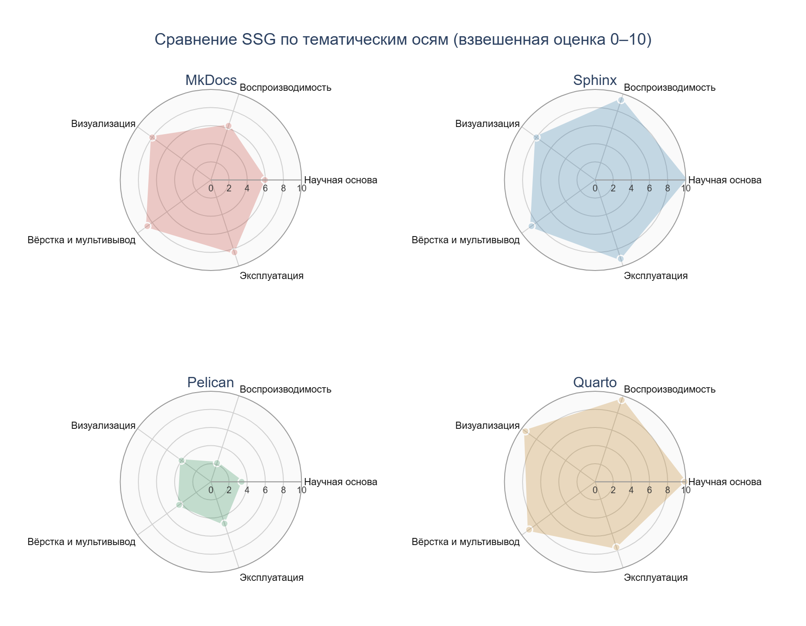
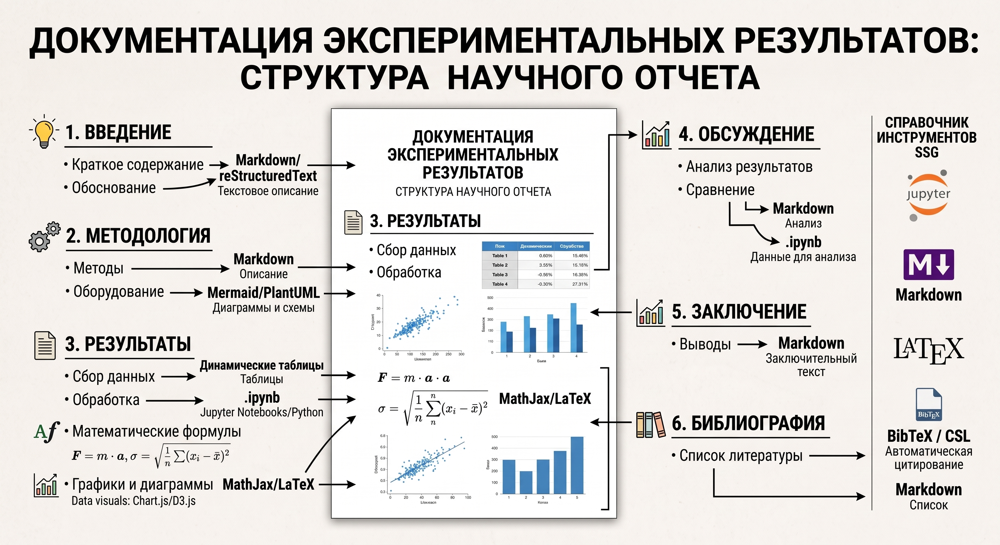

# T1: иллюстрации и исходные материалы

В разделе представлены диаграмма сравнительных оценок, схема структуры
научного отчёта и исходный текст [теоретического исследования](theory.md).

## Радар по тематическим осям

[Открыть исходную диаграмму PNG](assets/theory/radar_ssg.png).

Диаграмма показывает оценки по осям «Научная основа»,
«Воспроизводимость», «Визуализация», «Вёрстка и мультивывод» и «Эксплуатация».
Она включена как готовое изображение и не пересчитывается при сборке сайта.

## Структура научного отчёта

{ loading=lazy }

[Открыть исходную схему JPG](assets/theory/image2.jpg).

На схеме представлены основные разделы научного отчёта и инструменты
оформления текста, таблиц, формул, диаграмм и библиографии.

## Исходный текст

[Скачать исходный Markdown как TXT](downloads/theory-original.txt){ download="theory-original.txt" }

Исходный текст содержит матрицу из 18 критериев, веса, итоговые оценки,
обоснование выбора генератора и условия изменения вывода.

Для изменения теории редактируется `docs/theory.md`; иллюстрации находятся в
`docs/assets/theory/`. При сборке публикуются текст и статические изображения.
Эти файлы не входят в ключ кэша анализа P3.
