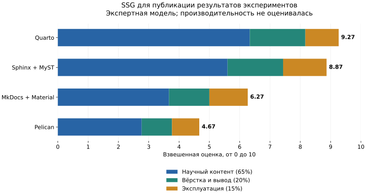

# T1: оценки и диаграмма

Это **авторская модель выбора**, а не результаты тестирования четырёх программ. [Возможности, источники и ограничения](theory.md) объясняют оценки. Дата проверки документации: 2026-10-01.

## Шкала и веса

| Балл | Смысл |
| --- | --- |
| 3 | Развитая поддержка критерия в выбранном основном стеке; обычная настройка |
| 2 | Поддержка с ограничениями или через отдельное документированное расширение |
| 1 | Частичное решение, ручная работа или собственная интеграция |
| 0 | В рассматриваемой конфигурации решения нет |
| — | Нет сопоставимых измерений; критерий исключён из суммы |

Оценка относится ко всему критерию: например, показ формулы ещё не означает наличия сквозной нумерации и ссылок на уравнения. Баллы 3 не означают, что каждая возможная подфункция встроена в ядро. Выбор расширений указан в сравнении.

**Научный контент — 65%.** Наибольшие веса у формул и воспроизводимых вычислений (по 12%); затем библиография (9%), рисунки и таблицы (по 8%). Это приоритеты исследовательского отчёта, а не блога или справочника API.

**Вёрстка и вывод — 20%.** Половина веса блока приходится на выпуск HTML и печатной версии из одного источника. **Эксплуатация — 15%.** Для небольшого отчёта сопровождение важно, но не доминирует над содержанием.

## Матрица

| Критерий | Вес, % | MkDocs + Material | Sphinx + MyST | Pelican | Quarto |
| --- | ---: | ---: | ---: | ---: | ---: |
| [Форматы исходников](theory.md#formats) | 5 | 2 | 3 | 2 | 3 |
| [Формулы и ссылки на уравнения](theory.md#math) | 12 | 2 | 3 | 1 | 3 |
| [Подписи и нумерация рисунков](theory.md#figures) | 8 | 1 | 3 | 1 | 3 |
| [Сложные и вычисляемые таблицы](theory.md#tables) | 8 | 2 | 3 | 2 | 3 |
| [Интерактивные визуализации](theory.md#interactive) | 6 | 2 | 2 | 1 | 3 |
| [Исполнение и кэш вычислений](theory.md#execution) | 12 | 1 | 2 | 1 | 3 |
| [Библиография и стили цитирования](theory.md#bibliography) | 9 | 2 | 2 | 1 | 3 |
| [Сноски, глоссарий, структура](theory.md#structure) | 5 | 2 | 3 | 2 | 2 |
| [Адаптивные сетки и карточки](theory.md#grids) | 5 | 3 | 2 | 1 | 3 |
| [Шаблоны и их переопределение](theory.md#templates) | 5 | 3 | 3 | 3 | 2 |
| [HTML, PDF и другие форматы](theory.md#outputs) | 10 | 1 | 3 | 1 | 3 |
| [Версии документации](theory.md#versions) | 2 | 2 | 2 | 1 | 1 |
| [Локальный поиск и русский язык](theory.md#search) | 3 | 3 | 3 | 1 | 2 |
| [Локализация интерфейса и контента](theory.md#i18n) | 2 | 2 | 3 | 2 | 2 |
| [Автодокументирование кода](theory.md#autodoc) | 3 | 2 | 3 | 1 | 2 |
| [Плагины, хуки и расширения](theory.md#extensions) | 2 | 3 | 3 | 3 | 3 |
| [Время сборки и размер сайта](theory.md#performance) | 0 | — | — | — | — |
| [Документация, открытый код, сопровождение](theory.md#maintenance) | 3 | 3 | 3 | 3 | 3 |

Сумма весов: **100%**. Вес производительности равен нулю из-за отсутствия общего эксперимента. Это ограничивает итоговый рейтинг.

## Расчёт

Для каждого инструмента: `итог = сумма(вес × балл) / 30`. Делитель 30 переводит максимум `100 × 3 = 300` в шкалу 0–10. Например, 12% и 2 балла за формулы дают `12 × 2 / 30 = 0,8` итогового балла.

| Инструмент | Научный контент (макс. 6,5) | Вёрстка (макс. 2) | Эксплуатация (макс. 1,5) | Итог / 10 |
| --- | ---: | ---: | ---: | ---: |
| Quarto | 6.33 | 1.83 | 1.10 | **9.27** |
| Sphinx + MyST | 5.60 | 1.83 | 1.43 | **8.87** |
| MkDocs + Material | 3.67 | 1.33 | 1.27 | **6.27** |
| Pelican | 2.77 | 1.00 | 0.90 | **4.67** |

Расчёт ведётся без промежуточного округления. Два знака после запятой показывают арифметику, а не точность экспертного мнения.



Каждый цвет — вклад группы с учётом её веса. Длина всей полосы совпадает с итогом таблицы. Диаграмма статическая и не загружает JavaScript с CDN.

## Файлы и воспроизводимость расчёта

[Исходные веса и баллы (JSON)](assets/theory/ssg-comparison.json), [диаграмма SVG](assets/theory/ssg-comparison.svg), [диаграмма PNG](assets/theory/ssg-comparison.png).

| Файл диаграммы | Размер, байт | Размер, КиБ (1024 байта) |
| --- | ---: | ---: |
| SVG | 65614 | 64.08 |
| PNG | 60376 | 58.96 |

Веса и баллы хранятся в `data/ssg_comparison.json`. После их изменения нужно выполнить в активированном окружении:

```powershell
python scripts/render_theory.py
python -m nox -s build
```

Первый шаг проверяет сумму весов и диапазон баллов, заново создаёт эту страницу и обе диаграммы. Полученные файлы сохраняются в Git. Обычная сборка сайта использует их как статические материалы. Эксперимент P3 и его кэш работают отдельно.

## Как читать результат

В выбранном сценарии лидирует **Quarto**: исполнение вычислений, научная разметка и несколько форматов вывода составляют большую долю оценки. **Sphinx** близок по научным возможностям и особенно удобен для справочника API. Разница не доказывает универсального превосходства: веса и баллы субъективны.

Изменение одного балла по критерию с весом 12% меняет итог на 0,4. Поэтому небольшое отличие итогов следует обсуждать вместе с требованиями, а не считать статистически значимым. [Условия смены выбора и объяснение использования MkDocs](theory.md#conclusion).
